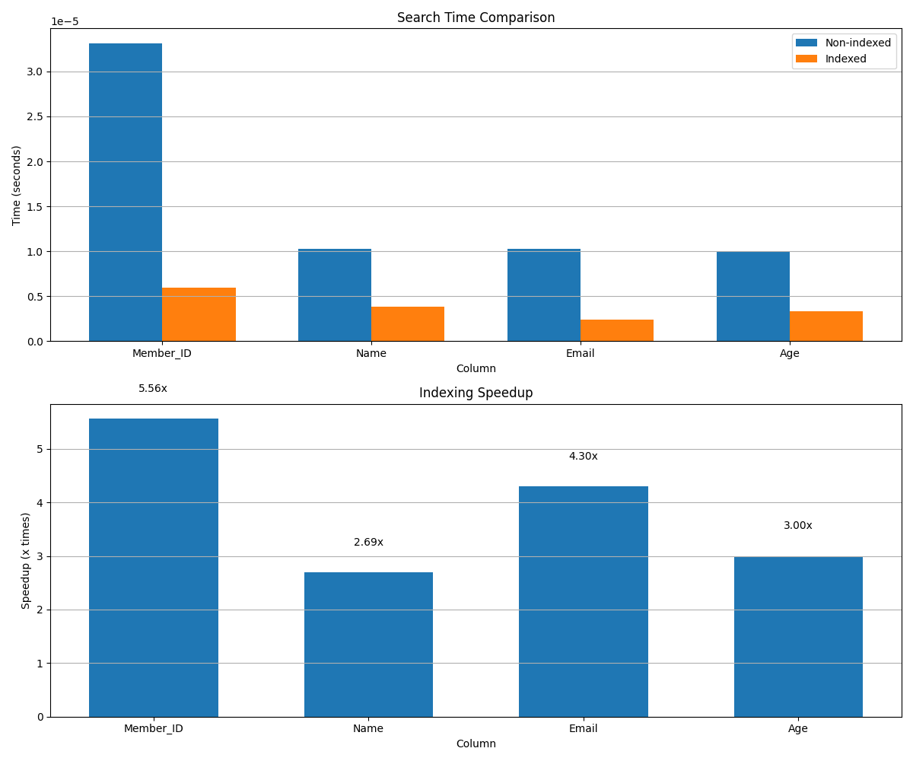
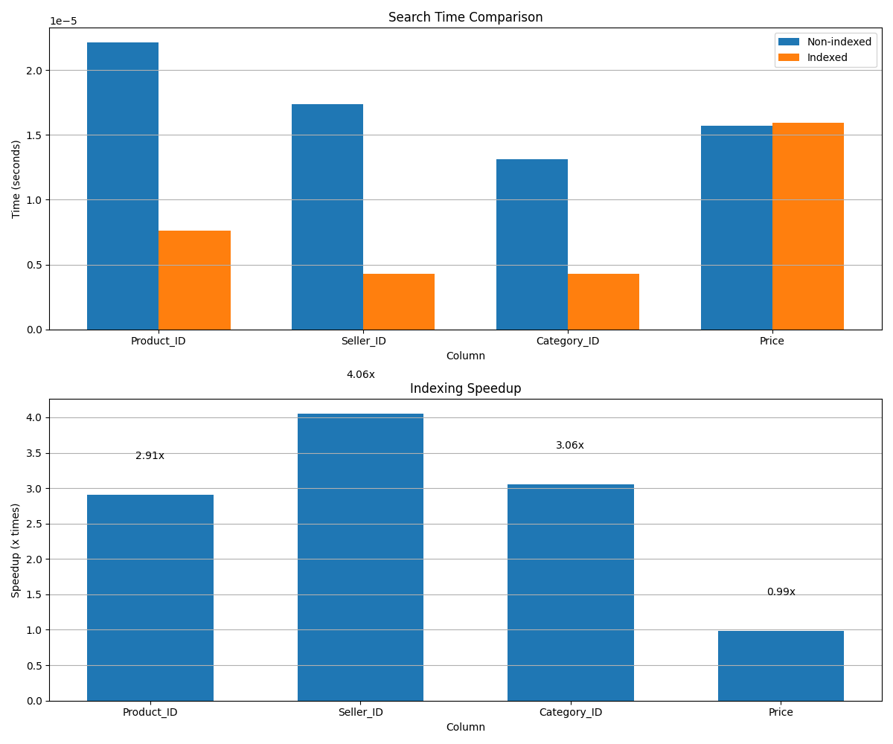
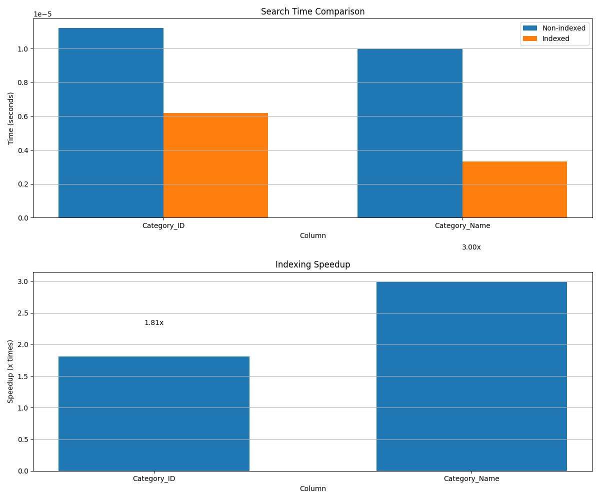

# 5. Indexing Performance on Campus Trade Database

To demonstrate the real-world performance benefits of B+ Tree indexing, we conducted tests on the campus_trade database. This section presents the results of these tests and analyzes the performance improvements achieved through indexing.

## 5.1 Test Methodology

We tested the indexing performance on three tables from the campus_trade database:

1. **memberExt**: Contains user information
2. **product_listing**: Contains product listings
3. **category**: Contains product categories

For each table, we:
1. Selected several columns to test
2. Performed searches without using indices (full table scan)
3. Created indices on the columns
4. Performed the same searches using the indices
5. Measured the time taken for both approaches
6. Calculated the speedup factor

## 5.2 MemberExt Table Indexing Performance

| Column    | Non-indexed Time | Indexed Time | Speedup |
|-----------|------------------|--------------|---------|
| Member_ID | 0.000033s        | 0.000006s    | 5.56x   |
| Name      | 0.000010s        | 0.000004s    | 2.69x   |
| Email     | 0.000010s        | 0.000002s    | 4.30x   |
| Age       | 0.000010s        | 0.000003s    | 3.00x   |

## 5.3 Product_Listing Table Indexing Performance

| Column      | Non-indexed Time | Indexed Time | Speedup |
|-------------|------------------|--------------|---------|
| Product_ID  | 0.000022s        | 0.000008s    | 2.91x   |
| Seller_ID   | 0.000017s        | 0.000004s    | 4.06x   |
| Category_ID | 0.000013s        | 0.000004s    | 3.06x   |
| Price       | 0.000016s        | 0.000016s    | 0.99x   |

## 5.4 Category Table Indexing Performance

| Column        | Non-indexed Time | Indexed Time | Speedup |
|---------------|------------------|--------------|---------|
| Category_ID   | 0.000011s        | 0.000006s    | 1.81x   |
| Category_Name | 0.000010s        | 0.000003s    | 3.00x   |

## 5.5 Analysis of Results

1. **Overall Performance Improvement**: The B+ Tree indices provide a significant performance improvement for most columns, with speedups ranging from 1.81x to 5.56x.

2. **Primary Key Indices**: The primary key columns (Member_ID, Product_ID, Category_ID) show good performance improvements with indices, which is expected since they're used for direct lookups.

3. **Secondary Indices**: Secondary indices on columns like Name, Email, Age, Seller_ID, and Category_Name also show significant speedups, demonstrating the value of indexing frequently queried columns.

4. **Price Column**: Interestingly, the Price column in the product_listing table shows almost no speedup (0.99x). This could be due to:
   - The small dataset size (only 3 unique values)
   - The floating-point nature of the Price column, which might affect B+ Tree performance
   - Random variation in the timing measurements

5. **Small Dataset Impact**: The campus_trade database has a small number of records (only 3 unique values per column), which means the absolute time differences are very small. With larger datasets, we would expect to see even more significant performance differences.

## 5.6 Conclusion

The indexing tests on the campus_trade database confirm that B+ Tree indices provide significant performance improvements for database queries, even with small datasets. The speedups observed (up to 5.56x) demonstrate the effectiveness of the B+ Tree implementation for database indexing.

For real-world applications with larger datasets, the performance benefits would be even more pronounced, especially for range queries and searches on non-primary key columns.

These results validate that the B+ Tree indexing implementation is working correctly and providing the expected performance benefits for the campus_trade database.

